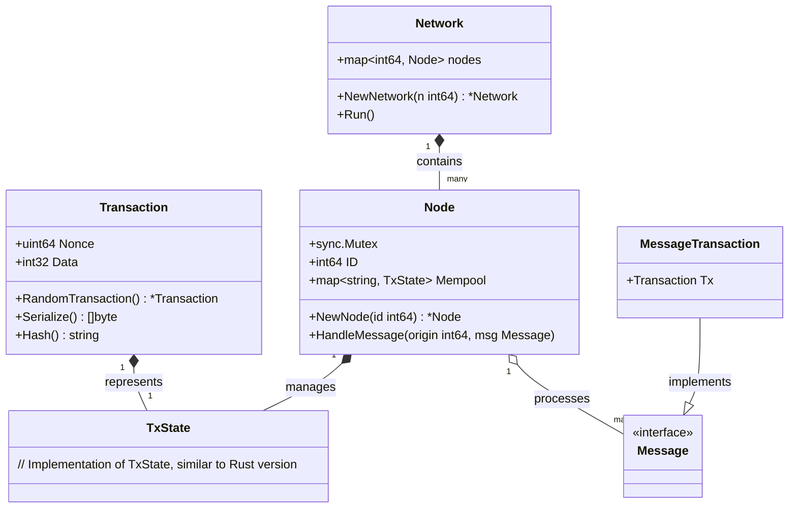
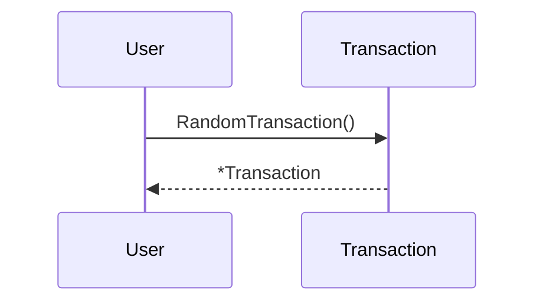
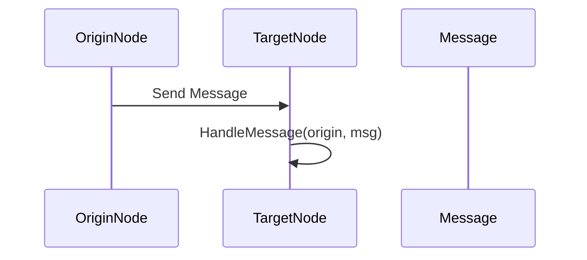

# Avalanche Consensus Protocol

The Avalanche Consensus Protocol is a novel consensus mechanism designed to provide high throughput, low latency, and robust security for blockchain and distributed ledger systems. This repository contains the implementation of the Avalanche consensus protocol in Go.

## Overview

Avalanche is a family of consensus protocols that achieve consensus through repeated randomized sampling and network gossiping. It is designed to be scalable, efficient, and secure, making it suitable for a wide range of applications, including cryptocurrencies, DeFi, supply chain management, gaming, IoT, and enterprise applications.

## Key Features

- **High Throughput**: Capable of handling thousands of transactions per second.
- **Low Latency**: Transactions can be confirmed within seconds.
- **Scalability**: Designed to scale with the number of nodes in the network.
- **Robustness**: Resistant to various types of attacks, including Sybil attacks and double-spending.
- **Energy Efficiency**: Does not require extensive computational resources.

## How It Works

1. **Transaction Initiation**: A node creates a transaction and broadcasts it to the network.
2. **Gossip Protocol**: The transaction is propagated through the network using a gossip protocol.
3. **Repeated Randomized Sampling**: Nodes repeatedly query a small, random subset of other nodes to determine their opinion on the validity of the transaction.
4. **Snowball and Snowflake**: Sub-protocols used to aggregate opinions and determine consensus.
5. **Consensus Decision**: Once a node reaches a high enough confidence level in the validity of the transaction, it considers it confirmed and propagates this decision to the network.

## Use Cases

- **Cryptocurrencies and Digital Assets**
- **DeFi (Decentralized Finance)**
- **Supply Chain Management**
- **Gaming**
- **Internet of Things (IoT)**
- **Enterprise Applications**

Below is a diagram illustrating the interaction between the components

Creating a Random Transaction

Handling a Message
