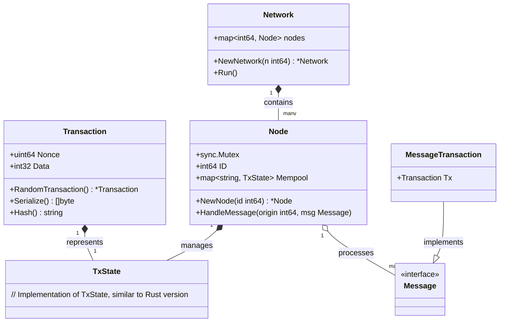
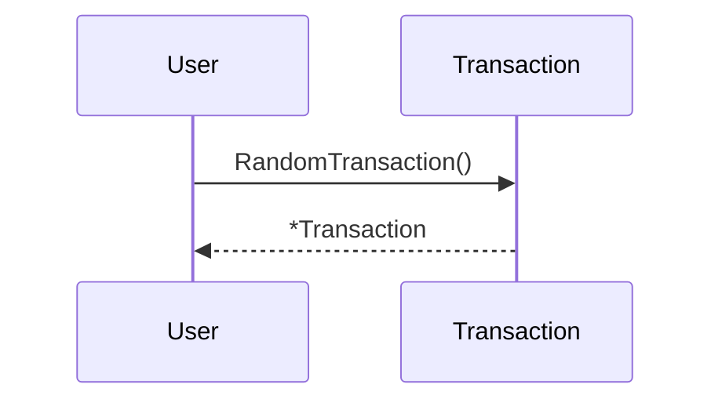
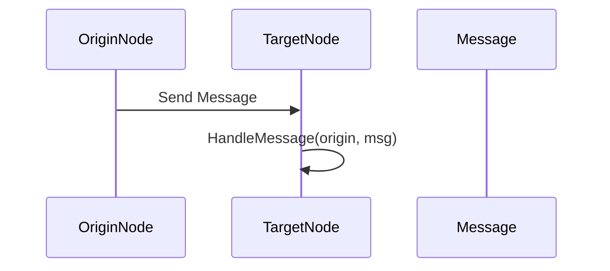

# Consensus Algorithms/Protocols

"Consensus" refers to a general agreement or a collective opinion among a group of individuals. It's a process of decision-making that seeks to achieve broad acceptance or agreement among members of a group, rather than enforcing a single dominant opinion. In a consensus approach, the members of the group work together to find a solution that is acceptable to everyone involved. This process often involves discussions, negotiations, and compromises to address the concerns and opinions of all members.

Consensus is important in various settings, including business, politics, and social groups, as it helps to ensure that decisions are made in a collaborative and inclusive manner. The aim is not necessarily for everyone to completely agree with the final decision, but rather for all participants to accept it as a reasonable outcome.

## Avalanche Consensus protocol

Avalanche Consensus is a consensus protocol that is scalable, robust, and decentralized. It combines features of both classical and Nakamoto consensus mechanisms to achieve high throughput, fast finality, and energy efficiency. For the whitepaper, see here.

Key Features Include:

- Speed: Avalanche consensus provides sub-second, immutable finality, ensuring that transactions are quickly confirmed and irreversible.
- Scalability: Avalanche consensus enables high network throughput while ensuring low latency.
- Energy Efficiency: Unlike other popular consensus protocols, participation in Avalanche consensus is neither computationally intensive nor expensive.
- Adaptive Security: Avalanche consensus is designed to resist various attacks, including sybil attacks, distributed denial-of-service (DDoS) attacks, and collusion attacks. Its probabilistic nature ensures that the consensus outcome converges to the desired state, even when the network is under attack.

Below is a diagram illustrating the interaction between the components

Creating a Random Transaction

Handling a Message
